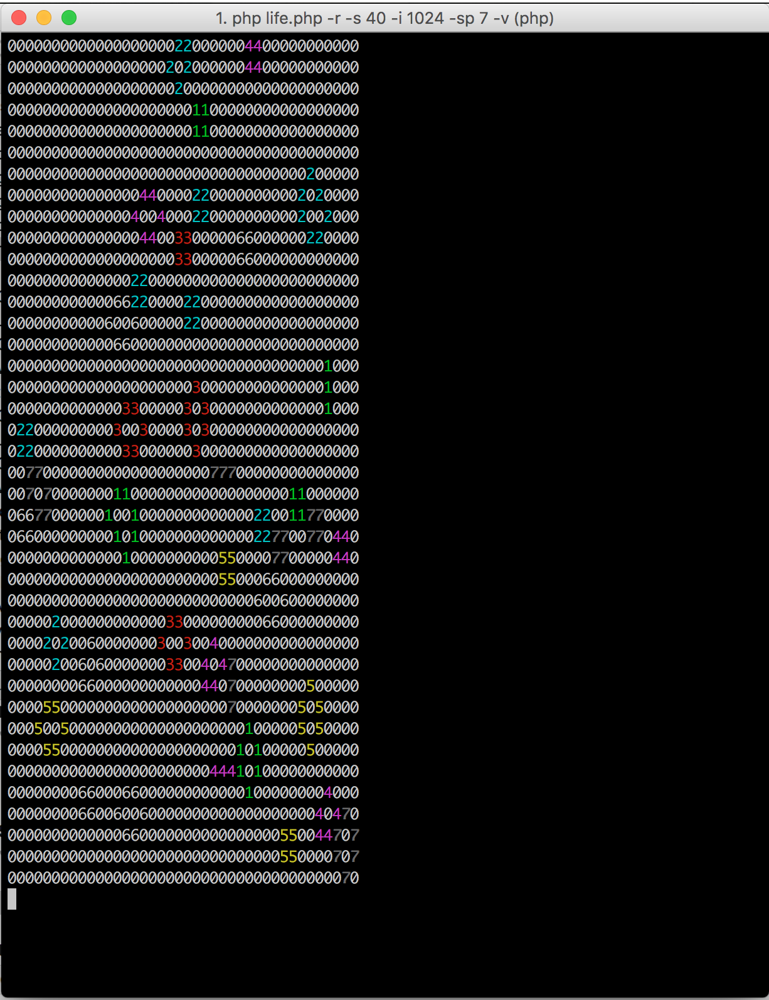

# game-of-life

[![Build Status][ico-travis]][link-travis]
[![Quality Score][ico-code-quality]][link-code-quality]
[![Coverage Status][ico-scrutinizer]][link-scrutinizer]
[![Software License][ico-license]](LICENSE.md)

Connway's game of life implementeation using PHP best practices



## Structure

```     
data/
src/
tests/
vendor/
```


## Install

Go to downloaded directory and use command

``` bash
$ composer install
```

## Usage

Getting help:
``` bash
$ php life.php -h

Connway's Game of Life by Midori Kocak

Usage: life.php [-f filename, --filename filename] [-h, --help] [-i iterations, --iterations iterations] [-o outputFilename, --outputFilename outputFilename (default: out.xml)] [-r, --random] [-s size, --size size] [-sp species, --species species] [-v, --verbose]

Optional Arguments:
	-r, --random
		Create Game of life from random matrix
	-i iterations, --iterations iterations
		Number of iterations
	-s size, --size size
		Square size of the world
	-sp species, --species species
		Amount of species
	-f filename, --filename filename
		File Name of XML input
	-o outputFilename, --outputFilename outputFilename (default: out.xml)
		File Name of XML output
	-v, --verbose
		Verbose output, shows GameOfLife in CLI
	-h, --help
		Prints a usage statement
```


Using a random array generated using size:
``` bash
$ php life.php -r -s 40 -i 1024 -sp 1 -v
```

Using a file:

``` bash
$ php life.php -v -f data/glider_gun.xml
```

## Change log

Please see [CHANGELOG](CHANGELOG.md) for more information on what has changed recently.

## Testing

``` bash
$ phpunit
```

## Contributing

Please see [CONTRIBUTING](CONTRIBUTING.md) and [CONDUCT](CONDUCT.md) for details.

## Security

If you discover any security related issues, please email midori@mynameismidori.com instead of using the issue tracker.

## Credits

- [Midori Kocak][link-author]

## License

The MIT License (MIT). Please see [License File](LICENSE.md) for more information.

[ico-license]: https://img.shields.io/badge/license-MIT-brightgreen.svg?style=flat-square
[ico-travis]: https://img.shields.io/travis/midorikocak/php-test-gol/master.svg?style=flat-square
[ico-scrutinizer]: https://img.shields.io/scrutinizer/coverage/g/midorikocak/php-test-gol.svg?style=flat-square
[ico-code-quality]: https://scrutinizer-ci.com/g/midorikocak/php-test-gol/badges/quality-score.png?b=master
[ico-downloads]: https://img.shields.io/packagist/dt/midorikocak/php-test-gol.svg?style=flat-square

[link-travis]: https://travis-ci.org/midorikocak/php-test-gol
[link-scrutinizer]: https://scrutinizer-ci.com/g/midorikocak/php-test-gol/code-structure
[link-code-quality]: https://scrutinizer-ci.com/g/midorikocak/php-test-gol
[link-downloads]: https://packagist.org/packages/midorikocak/php-test-gol
[link-author]: https://github.com/midorikocak
